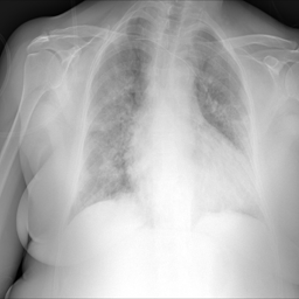
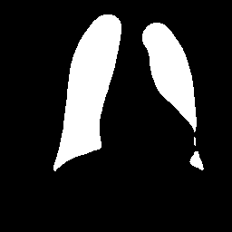
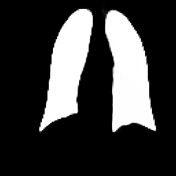

# Lung X-Ray Image Segmentation with U-Net

This project implements a deep learning model for the precise segmentation of lung fields in chest X-ray images. Its architecture is based on a U-Net, further refined through an adversarial approach with a PatchGAN discriminator to achieve high accuracy at segmentation boundaries.

The model achieves a Dice Score of 0.987 on the test data, surpassing the accuracy of the provided ground truth masks.
Example Results

Here you can see a comparison of the original image, the ground truth, and the prediction generated by the model:

<h3> Vergleich: Original | Ground Truth | Prediction</h3>

<table>
  <tr>
    <th>Original</th>
    <th>Ground Truth</th>
    <th>Prediction</th>
  </tr>
  <tr>
    <td></td>
    <td></td>
    <td></td>
  </tr>
</table>

<h3>Core Features</h3>

U-Net Architecture: Implementation of a U-Net model as the base for semantic segmentation.
Adversarial Training: Utilization of a PatchGAN discriminator to refine segmentation masks and improve edge sharpness.
Systematic Model Comparison: Evaluation and comparison of various model variants (e.g., with/without Dropout, 
with/without GAN) to find the optimal solution.
Data Preprocessing: Application of techniques like CLAHE to enhance contrast in input images.

<h3>💾 Download Model</h3>

Want to use the trained model yourself? You can download it directly from my Hugging Face profile:
https://huggingface.co/maja011235/lung-segmentation-gan
